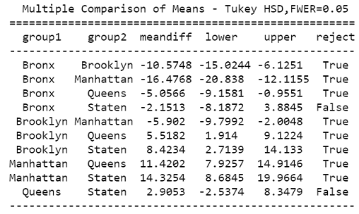
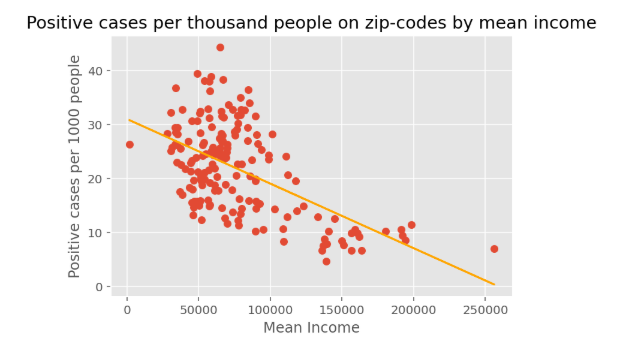
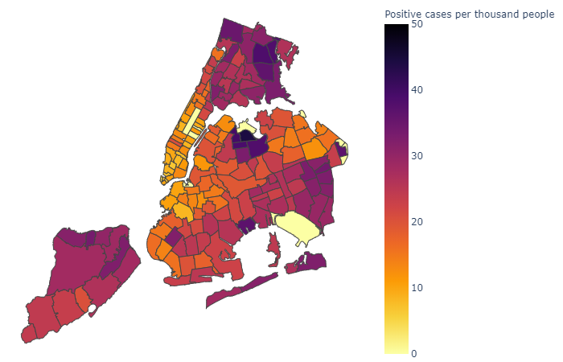
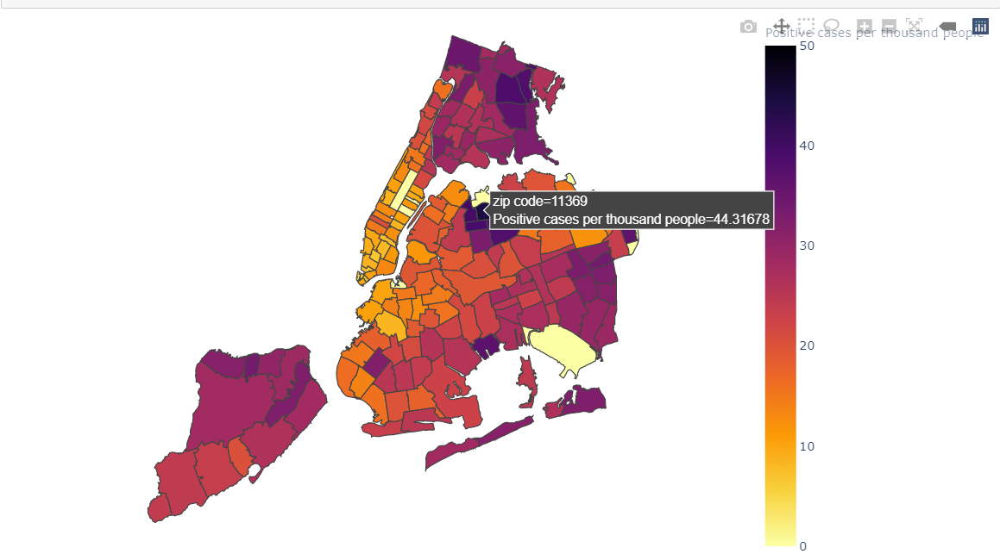
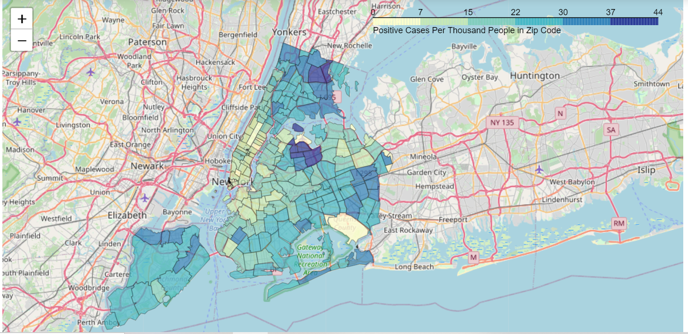

# Analysis of covid-19 cases in NYC boroughss

As part of my Computational Math and Stats midterm project 
I wanted to understand the impact of covid-19 cases among 
NYC zip codes and the association with economic and 
demographic indicators. All project code can be found in the jupyter notebook file 
#### Midterm Project Ruggiero Julian.ipynb

Steps of my analysis below:

## 1. Collected information from different data sources
- NYC Department of Health and Mental Hygiene (DOHMH): number of people tested, positive cases and corresponding ratio per zip code.
- US Zip code databases: population and density per zip code (as of 2016)
- US Census and Bureau reports: mean and median population income per zip code (as of 2016).

To create a fair comparison between zip codes that have more population than others I created a standardized variable called positive_per_thousand meaning number of positive cases per each 1000 people living in that zip code.
An example of the resulting data is in the image below

## 2.	Analyze positive cases per thousand people per borough.
Below is a box-plot showing positive covid-19 cases per thousand people living in each borough. We can see that Queens have some zip codes with up to 45 people tested positive whereas Manhattan some zip codes with only 5 positive per thousand living.

Here, I did a statistical analysis called ANOVA (analysis of variance) to compare the positive per thousand mean between each borough with the others. 
After executing the analysis, I reached the conclusion that except the comparison of Bronx-Staten and Queens-Staten, all other pairwise comparisons for positive per thousand indicates statistically significant differences between boroughs. 
I include below the actual results if you need for reference.

## 3.	Predict positive per thousand based on mean income
Created a linear regression model to predict positive per thousand cases on each zip code based on mean income.

We can see there is a negative association between mean income and positive cases per thousand people. However, after running statistical tests I conclude that the mean income ALONE can’t be used to predict positive per thousand cases in zip codes, a more complex algorithm is needed, which is built in the next step.

## 4.	Multiple linear regression to predict positive cases per thousand people in each zip code.

Here I included the other variables in the equation (mean income, median income, population and population density) and used a procedure called “backward elimination” to find a function that would help me to predict the positive number of cases per thousand people in each zip code.

Y = 23.6291 + (0.00002641 x population) – (0.00009394 x density) – (0.0000752 x mean income) + (9.5557 x borough Bronx) + (6.5033 x borough Queens) + (9.6407 x borough Staten)

Map of positive cases per thousand people by zip code (as of 05-22-2020).

The maps show a darker color for the zip codes that have a higher number of positive cases per thousand people and a lighter color for the ones with fewer number. We can hover over the darkest one to see the zip code number.

Another map representation

