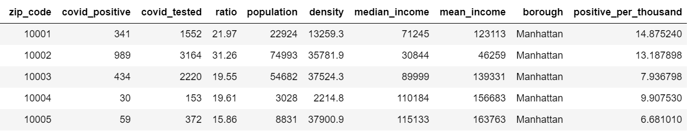
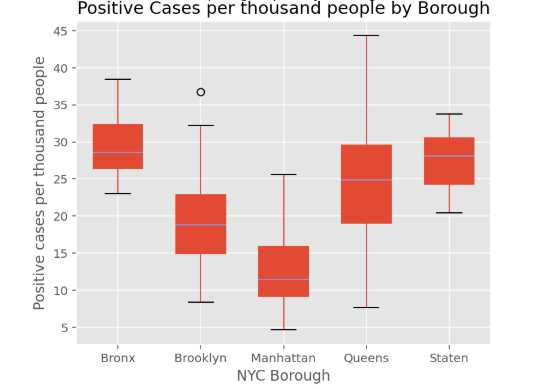

# Analysis of covid-19 cases in NYC boroughs

As part of my Computational Math and Stats midterm project 
I wanted to understand the impact of covid-19 cases among 
NYC zip codes and the association with economic and 
demographic indicators. Steps of my analysis below:

## 1. Collected information from different data sources
- NYC Department of Health and Mental Hygiene (DOHMH): number of people tested, positive cases and corresponding ratio per zip code.
- US Zip code databases: population and density per zip code (as of 2016)
- US Census and Bureau reports: mean and median population income per zip code (as of 2016).

To create a fair comparison between zip codes that have more population than others I created a standardized variable called positive_per_thousand meaning number of positive cases per each 1000 people living in that zip code.
An example of the resulting data is in the image below

## 2.	Analyze positive cases per thousand people per borough.
Below is a box-plot showing positive covid-19 cases per thousand people living in each borough. We can see that Queens have some zip codes with up to 45 people tested positive whereas Manhattan some zip codes with only 5 positive per thousand living.

